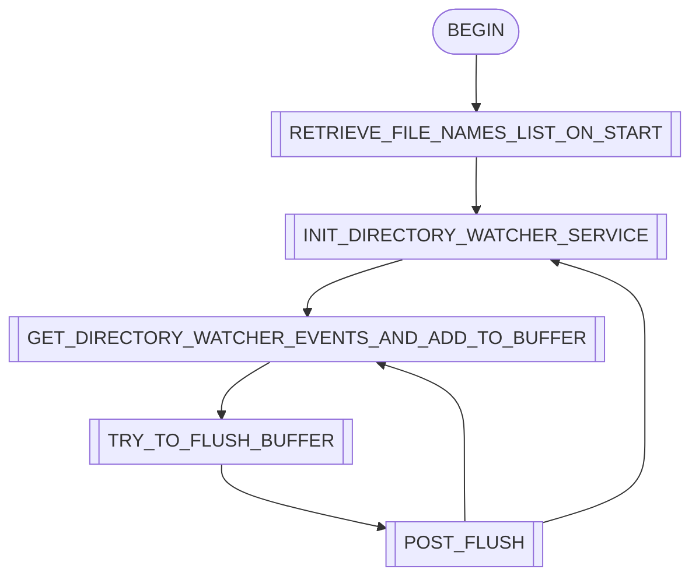
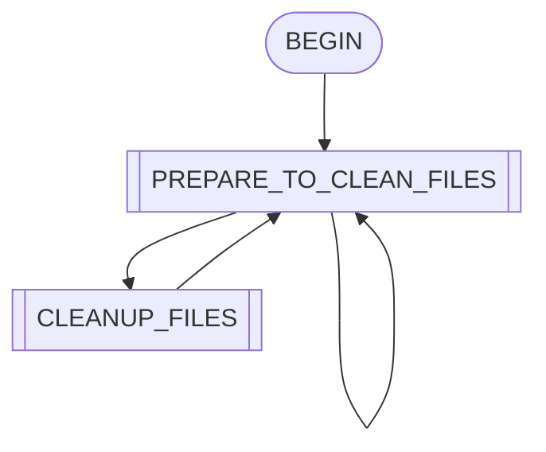

# crypto-data-service-loader
## About program
A standalone service that handles uploading ticker data to **Clickhouse**. Data from Clickhouse is used in **Grafana** for analytics.

The file containing ticker data has the following format name:
ticker_name_date. For example:
```AVA-USDT_PST_2024-03-14```  
_Within the file itself, the data is separated by a comma._  

All data is obtained using **KucoinAPI from the Kucoin exchange.**  
According to the API, the data contains the following information:
+ ticketName, 
+ sequence, 
+ price, 
+ size, 
+ bestAsk, 
+ bestAskSize, 
+ bestBid, 
+ bestBidSize, 
+ transactionTime

## Main Flows Description

The service consists of 4 flows working **isolated from each other and in parallel**. Flow diagram is presented [at the end of the readme](#flows-diagram).

Each flow has a parameter `WORK_CYCLE_TIME_HOURS/SEC`, which regulates the flow cycle time. **[For example](/MainService/src/main/resources/application.origin.yaml#L29).**

### Save new files to database flow

The first flow detects new files provided by the service using **KucoinAPI**. When a new file appears on disk after a certain time this file will be placed in filesBuffer with the help of `WatcherService` and then information about it will be loaded into the database.  
The table with information about the file contains the following columns: 
+ filename, 
+ create_date, 
+ status.

Thus, the new file will be loaded with the `DISCOVERED` status.

### Proceed files status flow

The second flow manages the statuses of files, namely, it puts them into `DOWNLOADING` or `READY_FOR_PROCESSING` statuses *according to some logic (for more details - [link](/MainService/src/main/java/com/crypto/service/flow/ProceedFilesStatusFlow.java))*.   
**Depending on the file status, it will be processed by the third flow.**

### Upload ticker files status and data flow

The third flow directly loads data from the files into the database into the corresponding table, if the file status is `READY_FOR_PROCESSING` - it means that the information about this ticker has been completely loaded and it will not be changed anymore.  
This flow is still some manager over the data loading process.  

#### How data is handled and about loading perfomance
**It starts the parent flow**, which in turn, with the help of two `executorService` will start more threads (32 by default).  
The entire set of files is divided into equal bundles of files of [a certain size](/MainService/src/main/resources/application.origin.yaml#L16) so that **each thread can process its part of the files.**   
One half of these threads compresses the data into GZIP format and sends it to a special [PipedInputStream](https://docs.oracle.com/javase/8/docs/api/java/io/PipedInputStream.html), where the other half of the thread is waiting for it on [PipedOutputStream](https://docs.oracle.com/javase/8/docs/api/java/io/PipedOutputStream.html) and then loading the stream of **compressed files** directly into Clickhouse.  
At the same time, the status of the file in the database changes to `IN_PROGRESS`. If an exception is caught, the file status will be set to `ERROR`.  
Thanks to this joint work of the threads, we managed to achieve a download speed of **200-300k rows/sec** on the Clickhouse server, which was hosted in ClickhouseCloud by Google in Netherlands. The same speed can be achieved using the Clickhouse CLI.

### Cleanup uploaded files flow

The fourth flow deals with clearing files on disk in case they are successfully loaded into the database.  
According to [some logic](/MainService/src/main/java/com/crypto/service/flow/CleanupUploadedFilesFlow.java), if the status of a file is `FINISHED`, it will be deleted from the disk.  
At the same time, in case of database errors or loading errors, a backup of the file is still stored on disk for a day.  
If the file processing status is `ERROR`, the file will not be deleted from disk, as it will require further reloading into the database.

### Logging

There are many points throughout the program where logging is used with `SLF4J + Log4j2`.  
Log messages are also sent to the Clickhouse database using [a custom-written ClickhouseAppender](/ClickHouseAppender/src/main/java/com/clickhouse/appender/ClickHouseAppender.java), a special log message handler that uploads them to the database.  
The log message in the database contains the message itself and its timestamp. The message is stored in `JSON` format.

### Testing

[Tests](/MainService/src/test/java/com/crypto/service/) are written for the program using `JUnit 5 and Mockito`.  
The coverage of methods and classes in flows package reaches **80%**.

## Flows Diagram
### 1. Save new files to database flow


### 2. Proceed files status flow


### 3. Upload ticker files status and data flow


### 4. Cleanup uploaded files flow
