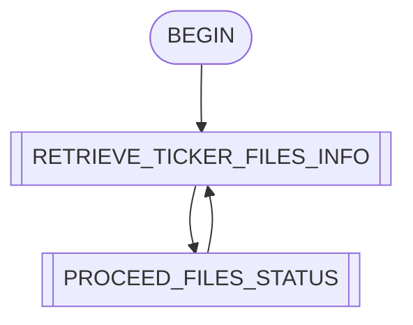
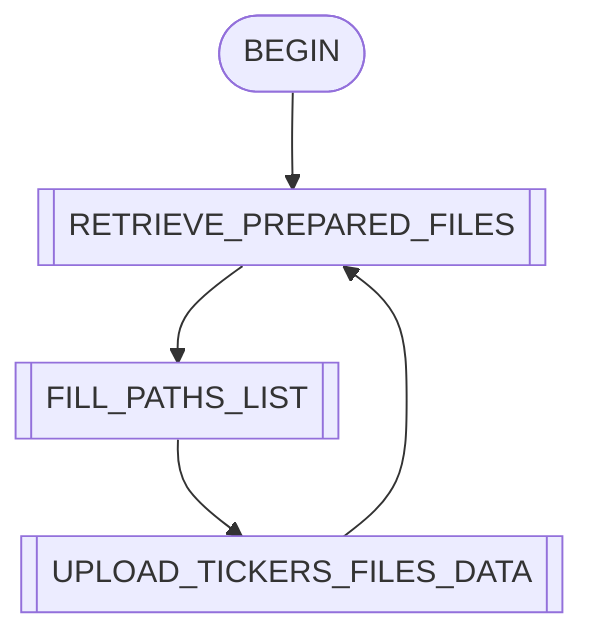

# crypto-data-service-loader

- ProceedFilesStatusFlow

```mermaid
flowchart
BEGIN([BEGIN])
PROCEED_FILES_STATUS[[PROCEED_FILES_STATUS]]
PROCEED_FILES_STATUS --> RETRIEVE_TICKER_FILES_INFO[[RETRIEVE_TICKER_FILES_INFO]]
RETRIEVE_TICKER_FILES_INFO[[RETRIEVE_TICKER_FILES_INFO]]
BEGIN([BEGIN]) --> RETRIEVE_TICKER_FILES_INFO[[RETRIEVE_TICKER_FILES_INFO]]
RETRIEVE_TICKER_FILES_INFO --> PROCEED_FILES_STATUS[[PROCEED_FILES_STATUS]]
```

- SaveNewFilesToDbFlow

```mermaid
flowchart
BEGIN([BEGIN])
RETRIEVE_FILE_NAMES_LIST_ON_START[[RETRIEVE_FILE_NAMES_LIST_ON_START]]
BEGIN([BEGIN]) --> RETRIEVE_FILE_NAMES_LIST_ON_START[[RETRIEVE_FILE_NAMES_LIST_ON_START]]
RETRIEVE_FILE_NAMES_LIST_ON_START --> INIT_DIRECTORY_WATCHER_SERVICE[[INIT_DIRECTORY_WATCHER_SERVICE]]
TRY_TO_FLUSH_BUFFER[[TRY_TO_FLUSH_BUFFER]]
TRY_TO_FLUSH_BUFFER --> POST_FLUSH[[POST_FLUSH]]
GET_DIRECTORY_WATCHER_EVENTS_AND_ADD_TO_BUFFER[[GET_DIRECTORY_WATCHER_EVENTS_AND_ADD_TO_BUFFER]]
GET_DIRECTORY_WATCHER_EVENTS_AND_ADD_TO_BUFFER --> TRY_TO_FLUSH_BUFFER[[TRY_TO_FLUSH_BUFFER]]
INIT_DIRECTORY_WATCHER_SERVICE[[INIT_DIRECTORY_WATCHER_SERVICE]]
INIT_DIRECTORY_WATCHER_SERVICE --> GET_DIRECTORY_WATCHER_EVENTS_AND_ADD_TO_BUFFER[[GET_DIRECTORY_WATCHER_EVENTS_AND_ADD_TO_BUFFER]]
POST_FLUSH[[POST_FLUSH]]
POST_FLUSH --> INIT_DIRECTORY_WATCHER_SERVICE[[INIT_DIRECTORY_WATCHER_SERVICE]]
POST_FLUSH --> GET_DIRECTORY_WATCHER_EVENTS_AND_ADD_TO_BUFFER[[GET_DIRECTORY_WATCHER_EVENTS_AND_ADD_TO_BUFFER]]
```

- UploadTickerFilesStatusAndDataFlow

```mermaid
flowchart
BEGIN([BEGIN])
RETRIEVE_PREPARED_FILES[[RETRIEVE_PREPARED_FILES]]
BEGIN([BEGIN]) --> RETRIEVE_PREPARED_FILES[[RETRIEVE_PREPARED_FILES]]
RETRIEVE_PREPARED_FILES --> FILL_PATHS_LIST[[FILL_PATHS_LIST]]
FILL_PATHS_LIST[[FILL_PATHS_LIST]]
FILL_PATHS_LIST --> UPLOAD_TICKERS_FILES_DATA[[UPLOAD_TICKERS_FILES_DATA]]
UPLOAD_TICKERS_FILES_DATA[[UPLOAD_TICKERS_FILES_DATA]]
UPLOAD_TICKERS_FILES_DATA --> RETRIEVE_PREPARED_FILES[[RETRIEVE_PREPARED_FILES]]
```